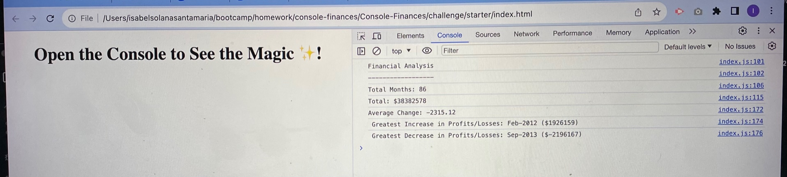

# CONSOLE FINANCES


## Description

Create a code to analyze the financial records of a company based on a financial dataset.


## Installation
Website:
https://joeviser.github.io/Console-Finances/

Screenshot Image:



## Usage

Write a JavaScript code that calculate each of the following:

* The total number of months included in the dataset.

* The net total amount of Profit/Losses over the entire period.

* The average of the **changes** in Profit/Losses over the entire period.

* The greatest increase in Profit/Losses (date and amount) over the entire period.

* The greatest decrease in Profit/Losses (date and amount) over the entire period.

Resulting analysis should look like this:

  ```text
  Financial Analysis 
  ----------------
  Total Months: 86
  Total: $38382578
  Average Change: -2315.12
  Greatest Increase in Profits/Losses: Feb-2012 ($1926159)
  Greatest Decrease in Profits/Losses: Sep-2013 ($-2196167)
 ```


## Credits

"N/A"

## License

Please refer to the LICENCE in the repo.